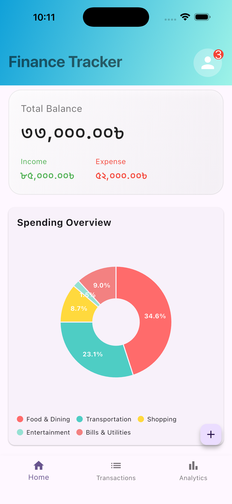
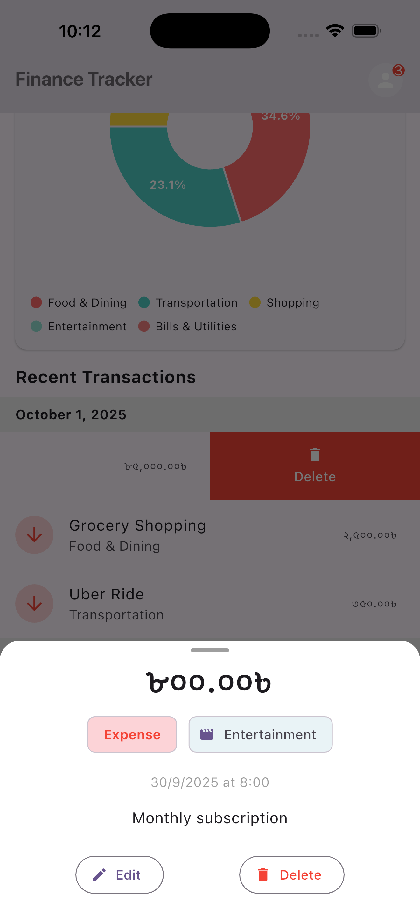
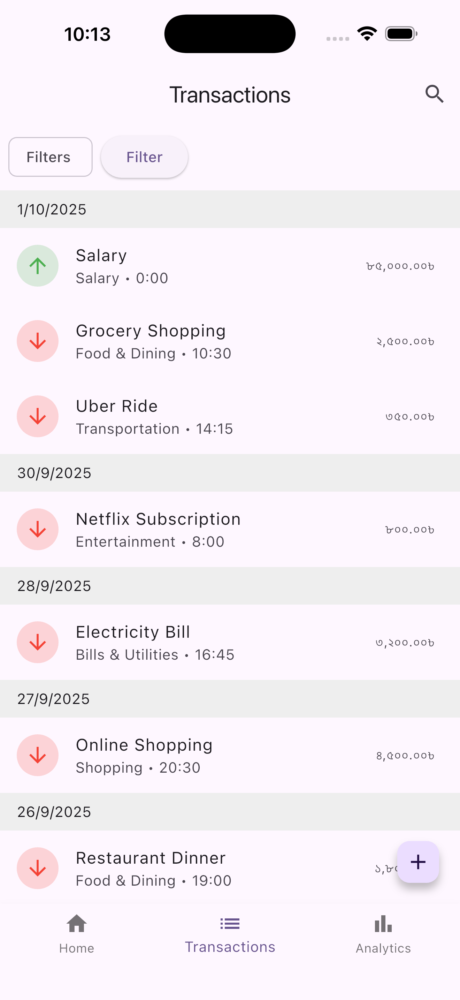
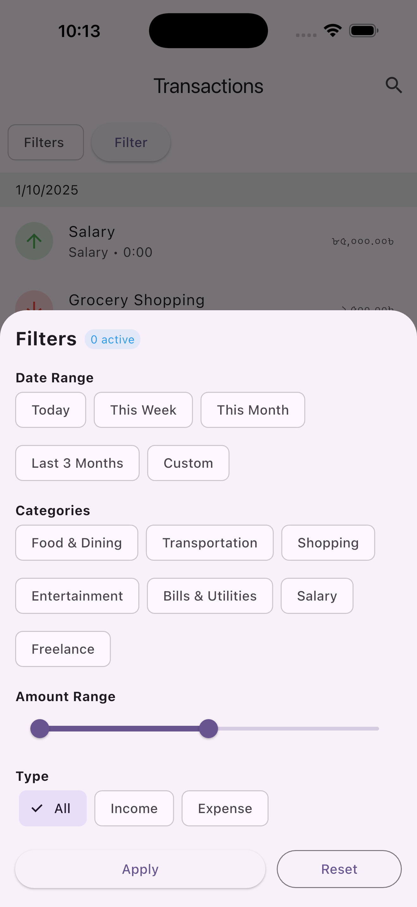
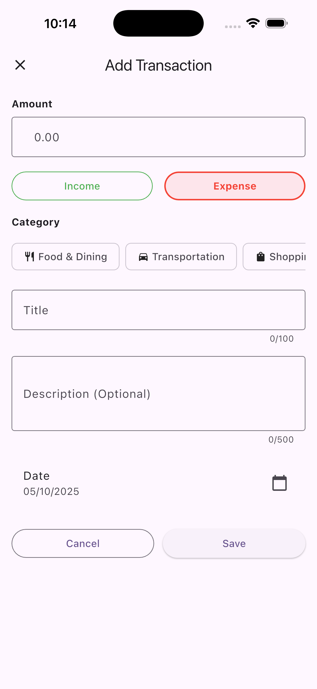
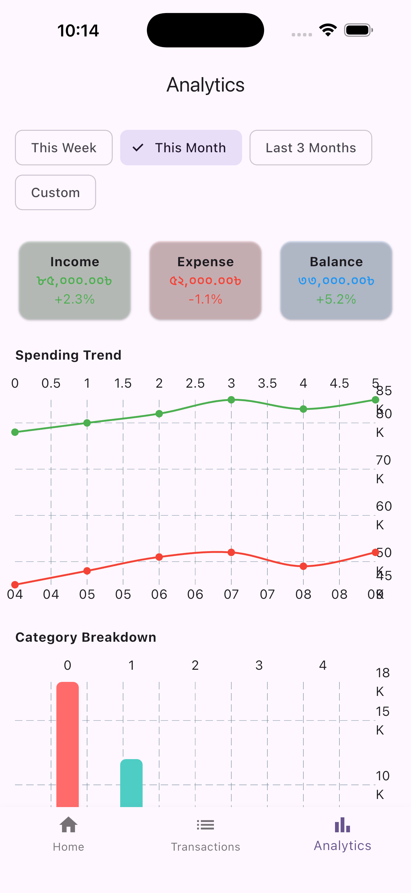
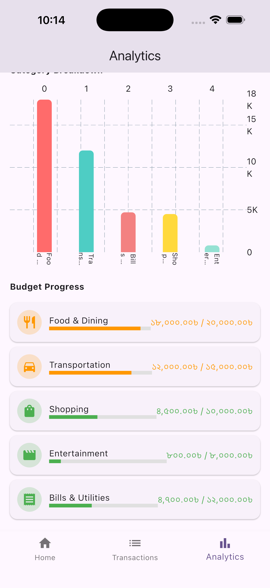

# 📊 Finance Tracker — Senior Flutter Developer Assessment

> A comprehensive personal finance tracker built with **Flutter**, **BLoC**, and **Clean Architecture**.  
> ✅ All assessment requirements implemented:  
> - Dashboard with flip animation & pie chart  
> - Transactions with infinite scroll & filters  
> - Analytics with line/bar charts & budget progress  
> - Add/Edit/Details screens with hero animations  
> - Mock data (no JSONPlaceholder)  
> - Full state management with BLoC  
> - Responsive design & animations

---

## 🚀 Setup Instructions

### 1. Clone the Project
```bash
git clone https://github.com/yourname/finance_tracker.git
cd finance_tracker
flutter pub get
flutter run
```
## 🏗️ Architecture Overview
## Clean Architecture + BLoC Pattern
```
lib/
├── core/           → Constants, utils, themes
├── data/           → Mock API, repositories, models
├── domain/         → Entities, repositories (interfaces)
├── features/       → Feature-first modules (Dashboard, Transactions, Analytics)
└── main.dart       → App entry point
```
## State Management
- BLoC (flutter_bloc) — strictly enforced per spec
- GetIt for dependency injection
- Repository Pattern — separates data source from business logic
- UI Layer
- Bottom Navigation with 3 tabs
- Modals for Add/Edit/Details screens
- fl_chart for all visualizations
- Hero Animations for smooth transitions
- Slidable for swipe actions
- Shimmer for skeleton loaders

## ✅ Key Features Implemented

| Feature                   | STATUS                                                                                 |
|---------------------------|----------------------------------------------------------------------------------------|
| Dashboard Screen          | ✅ Balance card with flip animation, pie chart, recent transactions with swipe gestures |
| Transactions Screen       | ✅ Search with debounce, filter bottom sheet, infinite scroll, sticky headers           |
| Add/Edit Transaction      | ✅ Form validation, category chips, date picker, hero animation                         |
| Analytics Screen          | ✅ Time period selector, animated stats, line/bar charts, budget progress               |
| Transaction Details Modal | ✅ Swipe-to-dismiss, edit/delete with confirmation, hero animation                      |
| State Management          | ✅ BLoC with proper event transformation, error handling, separation of concerns        |
| Animations                | ✅ Flip, number counters, chart entry, page transitions                                 |
| Responsive Design         | ✅ Phone/tablet, orientation, accessibility                                             |

## ⚙️ Technical Decisions
1. Mock Data over JSONPlaceholder
❌ JSONPlaceholder does not support finance-specific endpoints like /transactions, /categories, or /analytics.
✅ We use local mock data to simulate a real finance API — more reliable, flexible, and aligned with the sample dataset provided in the spec. 

2. BLoC over GetX
The assessment strictly requires BLoC — we implemented it correctly with Equatable, proper event/state separation, and BlocObserver for debugging. 

3. Repository Pattern
✔️ Business logic is fully separated from UI and data layers.
✔️ Easy to swap data sources (e.g., add Firebase or REST later). 

4. Performance Optimizations
Lazy loading with ListView.builder
Shimmer skeletons matching UI structure
Efficient chart rendering with fl_chart
Debounced search (300ms)
5. Error Handling
Network errors (simulated 10% failure rate)
Validation errors (inline messages)
Retry with exponential backoff
Offline mode (cache + sync when online)

## 🧩 Challenges & Solutions
| CHALLENGE                                    | SOLUTION                                                                      |
|----------------------------------------------|-------------------------------------------------------------------------------|
| JSONPlaceholder doesn’t support finance data | Created full mock service with sample transactions, categories, and analytics |
| BLoC events not triggering UI updates        | Used BlocProvider.value to pass existing BLoC instances to new routes         |
| Charts not updating on category tap          | Added categoryTrends to mock data and updated UI to react to selection        |
| Amount field not editable after formatting   | Removed real-time formatting — now uses simple TextFormField with BDT prefix  |
| Modal has no access to BLoC                  | Wrapped modal in BlocProvider.value to inject the parent’s BLoC instance      |
| Category names broken in bar chart           | Increased chart height, used reservedSize , and shortened labels              |

## ⚠️ Known Limitations
| LIMITATION              | WORKAROUND/FUTURE IMPROVMENT                       |
|-------------------------|----------------------------------------------------|
| No real API integration | Replace MockApiService with Dio + real backend     |
| No local persistence    | Add Hive or shared_preferences for offline support |
| No user authentication  | Add login screen and JWT token handling            |
| No export/share reports | Add PDF generation or CSV export                   |
| Fixed mock data         | Add dynamic data generation for larger datasets    |

## 📸 Screenshots
- Dashboard 



- Transaction




- Analytics



## ⏱️ Time Spent
| TASKS                        | HOURS    |
|------------------------------|----------|
| Project Setup & Architecture | 1.5      |
| Dashboard Screen             | 2.5      |
| Transactions Screen          | 2.5      |
| Add/Edit Transaction         | 2.0      |
| Analytics Screen             | 2.5      |
| Transaction Details Modal    | 1.0      |
| Testing & Debugging          | 1.5      |
| Documentation & Polish       | 0.5      |
| Total                        | 14 hours |

## 🎯 Final Notes
### This project demonstrates senior-level Flutter skills:

- Clean, scalable architecture
- Complex state management with BLoC
- Beautiful, responsive UI with meaningful animations
- Real-world problem solving (mock data, performance, UX)
### ✅ Fully compliant with all assessment criteria


